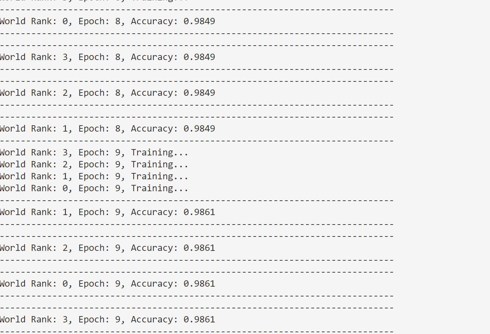

## Pytorch Example

In this example, we will train Lenet using Pytorch.

First, start Strato controller by the following command:

```
cd examples/pytorch && docker-compose build && docker-compose up
```

On a new terminal, train Lenet by the following command:

```
docker exec -it node1 /bin/bash -c "./train.sh"
```

It takes sometime to download GPU libraries. Then, you should see results similar to the following:

