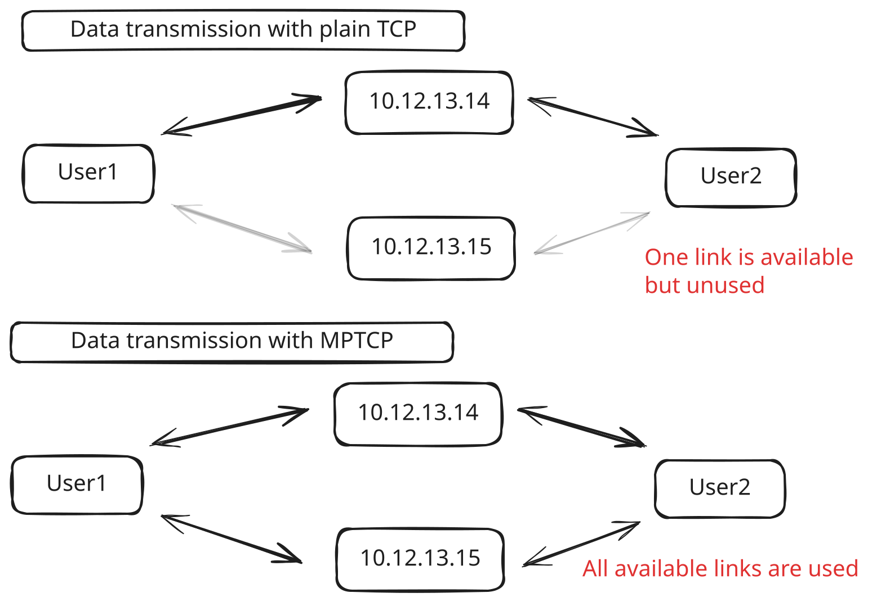

## Flow_id

**Definition**: A 64-bit identifier (u64) that represents a flow of traffic between source and destination IP addresses.

**Implementation**: Extracted from bytes 12-20 of a packet (representing source and destination IP addresses).

## Stream_id

**Definition**: `stream_id = (source_port, dest_port)`

**Implementation**: The system first checks if the packet is an IPv4 packet (by examining the first 4 bits of the first byte).
Then, it checks if the IPv4 packet's protocol field (byte 9) indicates either TCP (value 6) or UDP (value 17).
If either condition is true, it extracts the source and destination ports from the appropriate header and sets them as the stream_id.
`stream_id` is only extracted from packets that carry TCP or UDP traffic.

The primary role of StreamID is for fine-grained path selection when the multipathing method is set to "stream".


## route_id

**Definition**:

```rust
pub struct Route {
    next_hop: NodeID,
    id: u8,
    streams: Vec<SocketID>,
}
```

This is an identifier for a specific route within a Flow.

```rust
pub struct Flow {
    flow_id: FlowID,
    routes: Vec<Route>,
}
```
When a packet belonging to a stream needs a path assigned,
the Processor either looks up or assigns a route_id (referred to as path_id in the processor logic).

These terms seem largely interchangeable in this context.
A `Route` object defines a specific path a flow can take. It includes the `next_hop` `NodeID` and the `route_id`.

A `Flow` can have multiple `Routes` associated with it, enabling multipathing.

The chosen `route_id` (`path_id`) determines which specific path (and therefore `next_hop`) is used for a packet.

`n_routes`: Tracks how many routes are available for each flow

## if_id

In stream mode, the `path_id` assigned to streams does not directly affect `if_id`, as `if_id` is derived from the original `flow_id`. For a single TUN device, the `if_id` should ideally be 0 or correspond to a queue index within the device, but the code uses the destination IP's third byte directly.

### Relationship Between if_id and tun_writers in "stream" mode

In `processor.rs`, `if_id` is used to index into `tun_writers`. `tun_writers` is a `Vec<TunWriter>` obtained from `context.get_tun_writers(queue_id)` in `context.rs`. `self.tun_writers` is an `Arc<RwLock<Vec<Vec<TunWriter>>>>`, where the outer `Vec` corresponds to `queues (queue_id)`, and each inner `Vec<TunWriter>` contains `TunWriters` for that `queue`, with one `TunWriter` per TUN device.

When `get_tun_writers(queue_id)` is called, it returns a `Vec<TunWriter>` with length 1.

In `Processor::run`, `tun_writers.get_mut(if_id as usize)` expects if_id to be a valid index into this inner Vec. Since the inner Vec has length 1, `if_id` must be 0 (i.e., `tun_writers[0]` is valid, but `tun_writers[1]` will trigger the expect error).

## Packet

```rust
pub struct Packet {
    pub flow_id: FlowID,
    pub packet_size: usize,
    pub stream_id: SocketID,
    pub has_stream_id: bool,
    pub buf: PacketBuf,
}
```

## RoutingTable

stream_mapping: `FxHashMap<(FlowID, SocketID), u8>`:
This map explicitly links a specific StreamID within a FlowID to a RouteID (path), for stream-based multipathing lookups (get_path_id).


## Multi-path method

A key design goal of Strato is to enable multi-path data
transport over WAN to bypass the single-path bandwidth limitations.

Strato takes advantage of another widely available feature,
multi-TCP connection, to facilitate multi-path transport.

### Multipath TCP connection





In standard TCP, the connection should be established between two IP addresses. Each TCP connection is identified by a four-tuple (source and destination addresses and ports). Given this restriction, an application can only create one TCP connection through a single link. Multipath TCP allows the connection to use several paths simultaneously. For this, Multipath TCP creates one TCP connection,
called subflow, over each path that needs to be used.

When multiple TCP "streams" (or connections) share both network bandwidth and CPU processing,
it's very easy for one to dominate and starve the others:
- Winning stream grabs more of everything.

Positive feedback: more bandwidth → less delay → more bandwidth → …
- Loser stream falls further behind

To prevent this "rich get richer, poor get poorer" cycle, in the context of tun version 0.6, strato enforces per‐stream isolation,
which binds each stream to a distinct Packet Processor module.

## SenderLoadBalancer

```rust
pub struct SenderLoadBalancer {
    txs: Vec<Sender<Packet>>, // Transmit channels
    tx_current: usize,
    stream2proc: FxHashMap<(SocketID, FlowID), usize>,
    flow2proc: FxHashMap<FlowID, usize>,
    n_proc: usize,
}
```

The Role of SenderLoadBalancer:

`stream2proc`: Maps (stream_id, flow_id) pairs to processor IDs

`flow2proc`: Maps flow_id to processor IDs.

This is used by the SenderLoadBalancer to ensure consistent routing of packets belonging to the same flow.
`flow2proc: FxHashMap<FlowID, usize>,`

This mapping is used when:
The packet doesn't have a stream ID (has_stream_id = false)
Or when in interface mode, where packets are only identified by their flow ID

## Difference between NodeReceiver and TunReader
### NodeReceiver

`NodeReceiver` handles incoming network traffic from other nodes in the distributed system.
It works with various network protocols including: TCP, UDP and QUIC.

A NodeReceiver contains:
`remote_node_id`: Identifies the remote node it's communicating with
`reader`: A protocol-specific reader (TCP, UDP, or QUIC)
`tx`: A load balancer that distributes packets to processors

It continually reads incoming packets from the network, creates Packet objects,
records metrics, and forwards them to processors.

Created when establishing connections with other nodes in the distributed system,
typically through functions like `create_tcp_node_interfaces`, `create_udp_node_receiver`, or `create_quic_node_interfaces`.
And we can also add whichever protocols we want to use in Strato.

### TunReader

TunReader interfaces with a TUN (network tunnel) device,
which is a virtual network interface.
It handles traffic to/from the local operating system and the application rather than connections between nodes.

Structure：
```rust
pub struct TunReader {
    inner: Arc<Mutex<AsyncDevice>>, // Use Arc<Mutex> for mutable access
    tx: SenderLoadBalancer,
}
```

Created when initializing the system's local network interface through `start_tun_device`.

And note that if we are in the `"stream"` mode, TunReader will call `packet.try_set_stream_id()` on packets.
```rust
impl TunReader {
    ...

    pub async fn start_reading(&mut self, method: String) {
        let mut buf = [0; RECEIVE_BUF_SIZE];
        loop {
            let n = match self.inner.lock().await.read(&mut buf).await {
                Err(_) => panic!("Error reading from tun interface"),
                Ok(n) => n,
            };

            let mut packet = Packet::new(n, buf);
            if method == "stream" {
                packet.try_set_stream_id();
            }
            self.tx.try_send(packet);
        }
    }
}
```


## protocol

### udp
In Controller::connect()

```rust
if controller_configs.protocol == "udp" {
    context
      .add_udp_socket(configs.private_network_port.clone())
      .await;
}
```

What it does: binds a single UdpSocket on 0.0.0.0:private_network_port.

### TCP

When the controller tells you to add a TCP node, ControllerReceiver::new_tcp_node runs:

```rust
let stream = protocols_client::connect_tcp_node(local_id, addr, node_id, &session_id).await;
context.add_tcp_node(node_id, stream).await;
```
### QUIC

```rust
let conn = protocols_client::connect_quic_node(local_id, addr, node_id, &session_id).await;
context.add_quic_node(node_id, conn).await;
```
