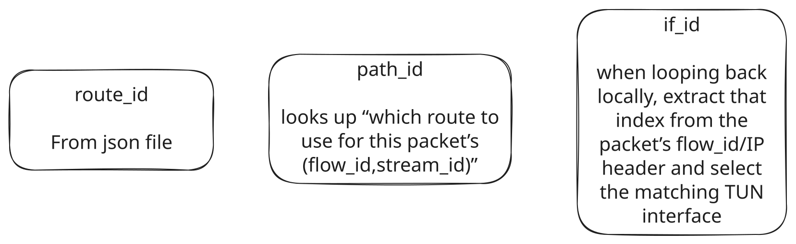

## if_id

### path_id

In the simple example,

```json
{
    "multi_path_method": "stream",
    "route_ids": [0, 1]
}
```
- **Physical Network**: All traffic flows through a single TUN device (`tun0`).
- **Logical Paths**: Two virtual paths are created by modifying the **third byte of the IP header** (e.g., `10.0.`**`X`**`.Y`):
  - **Path 0**: `X = 0` (e.g., `10.0.`**`0`**`.1` → `10.0.`**`0`**`.2`)
  - **Path 1**: `X = 1` (e.g., `10.0.`**`1`**`.1` → `10.0.`**`1`**`.2`)

- An IPv4 header is **20 bytes** (minimum). The source IP starts at byte **12**:
  ```
  Byte Index: 12  13  14  15
              ▼   ▼   ▼   ▼
  IP:        10   0   0   1  (Example: 10.0.0.1)
  ```
- Thus:
  - `buf[12]` = First octet (`10`)
  - `buf[13]` = Second octet (`0`)
  - `buf[14]` = Third octet (`0` or `1` for paths)  👈 **Critical for path selection**
  - `buf[15]` = Fourth octet (`1`)

```rust
packet.update_route(path_id); //The 14th byte is the third byte of the IPv4 addr, which we use to set the route.
            //We are also going to report the metrics to the metrics collector
            self.metrics_tx.send((packet.flow_id, packet.stream_id, self.routing_table.local_id(), packet.packet_size)).expect("Failed to send metrics to metrics collector.");
```

### **Path vs. `if_id` Distinction**
- **`path_id`**: Determines the *logical path* (via IP modification).
  - Set in `update_route()` → Used by routing tables.
- **`if_id`**: Derived from `flow_id` to select a **TUN queue** (unrelated to paths in `stream` mode):
  ```rust
  let if_id = (packet.flow_id & FLOW_ID_IF_MASK) >> 8; // 0 or 1
  ```
  - Only affects which processor queue handles the packet.

### **Where `if_id` is Calculated**
In `processor.rs`, during packet processing:
```rust
let if_id = (packet.flow_id & FLOW_ID_IF_MASK) >> 8;
// FLOW_ID_IF_MASK = 0x00000000_0000FF00
```
- **`FLOW_ID_IF_MASK`** isolates bits 8–15 of `flow_id` (where the 3rd byte of the source IP is embedded).
- **`>> 8`** shifts right by 8 bits to extract the pure `if_id` value (0 or 1 in your config).

---

## flow_id, stream_id, path_id, if_id

This document explains how we compute and use four identifiers in our packet processor:

1. **flow_id**
2. **path_id**
3. **if_id**
4. **stream_id**



---

### 1. flow_id

- A “flow” is defined purely by the 8‑byte big‑endian concatenation of IP source + IP destination.
- In `Packet::get_flow_id_from_buf()` (mod.rs), we do:

  ```rust
  // bytes 12..20 of the IPv4 header: src (4 bytes) || dst (4 bytes)
  let mut cursor = Cursor::new(&buf[12..20]);
  let flow_id = cursor.read_u64::<BigEndian>().unwrap();
  // Equivalent to (src_ip << 32) | dst_ip
  ```

- So
  ```
  flow_id = (src_ip << 32) | dst_ip
  ```

---

### 2. path_id

- `path_id ∈ {0,1,…,num_paths–1}` is the index of which next‑hop/path to use for this flow (or stream).
- **Storing routes**
  When routing info arrives from the controller, in `routes.rs::RoutingTable::add_flow()`:
  ```rust
  for route in &routes {
      let flow_route_id = flow_id
                        + ((route.id as u64) << 40);
      // FLOW_ID_PATH_MASK clears bits 8–15
      let key = flow_route_id & FLOW_ID_PATH_MASK;
      next_hop[key] = route.next_hop;
      n_paths[flow_id & FLOW_ID_PATH_MASK] = routes.len();
  }
  ```
  - `FLOW_ID_PATH_MASK = 0xFFFF_FFFF_FFFF_00FF`
    clears out bits 8–15 so the table key is just the original `flow_id`.
- **Assigning a path at runtime**
  In `Processor::run()` for each packet:
  1. Compute `(flow_id, stream_id)` if `packet.has_stream_id`.
  2. Look up an existing path; if none:
     ```rust
     let count = stream_counters[flow_id].fetch_add(1, SeqCst);
     let path_id = count % num_paths;
     stream2routes.insert((flow_id,stream_id), path_id);
     routing_table.stream_mapping.insert((flow_id,stream_id), path_id);
     ```
  3. Stamp the packet and update its in‑memory `flow_id`:
     ```rust
     packet.update_route(path_id);
     // inside update_route:
     buf[14] = path_id;                    // 3rd byte of src IPv4
     self.flow_id += (path_id as u64) << 40;
     ```

---

### 3. if_id

- `if_id` is the interface index to write the packet back to when `next_hop == local_id`.
- Computed just before sending out:
  ```rust
  // FLOW_ID_IF_MASK picks out bits 8–15 of flow_id
  let if_id = (packet.flow_id & FLOW_ID_IF_MASK) >> 8;
  ```
- Since we placed `path_id` into bits 8–15 in `update_route`, we get
  ```
  if_id == path_id
  ```
- Finally:
  ```rust
  tun_writers[if_id].write_packet(...);
  ```

---

### 4. stream_id

- A per‑packet 4‑byte tuple `(src_port, dst_port)` set only for TCP or UDP.
- In `Packet::try_set_stream_id()` (mod.rs):
  1. Parse the IPv4 header.
  2. If `proto == 6` (TCP) or `17` (UDP), read:
     ```rust
     let src_port = cursor.read_u16::<BigEndian>()?;
     let dst_port = cursor.read_u16::<BigEndian>()?;
     self.stream_id = ((src_port as u32) << 16) | dst_port as u32;
     self.has_stream_id = true;
     ```

---

## Putting it all together: **stream** mode

- one TUN device (num_interfaces = 1) with N queues.
- For **each incoming packet**:
  1. Compute `flow_id` (src‖dst) and, if applicable, `stream_id` (ports).
  2. Lookup `(flow_id,stream_id)` in the routing table.
  3. If no mapping exists, pick a new `path_id` via round‑robin and install it.
  4. Call `packet.update_route(path_id)`:
     - Stamps `buf[14] = path_id` into the IP header.
     - Updates `packet.flow_id += (path_id<<40)`.
  5. Lookup `next_hop` using the new `flow_id`.
  6. If `next_hop == local_id`, extract:
     ```rust
     let if_id = (packet.flow_id & 0x0000_0000_0000_FF00) >> 8;
     ```
     and write back out queue `if_id`.


**under the hood **`if_id` is literally the same value as `path_id`** (it’s just re‑extracted from the bits where we shoved it)**

In **interface**‑mode that becomes the index of the TUN interface when write into; in **stream**‑mode we still stamp a `path_id` into each packet,
but because we only ever create a single TUN interface, `if_id` must always be 0.

```text
tun_writers: Vec<Vec<TunWriter>>
       └── queue_id ──► Vec<TunWriter>   (length = num_interfaces)
                    └── interface_id ──► TunWriter (raw_fd corresponding to that queue/interface)
```


#### assumption

Since the underlying queue count is always one, we need to revise Strato’s multi-queue assumption so that all processors share a single TUN queue, and then clone each write operation in user space for delivery to every processor.

Would it work if we did it this way?

Initialize exactly one queue

```rust
+ // Only do once: create 1 queue that starts empty
+ if guard.is_empty() {
+     guard.push(Vec::new());
+ }
```

push a single empty `Vec<TunWriter>` the first time

Collapse per‐queue push into a single‐queue push

```rust
- let writer_qs = start_tun_device(controller_configs, dev, receiver_txs);
- let mut i = 0;
- for q in writer_qs {
-     if let Some(qs) = guard.get_mut(i) {
-         qs.push(q);
-     } else {
-         // … code to grow guard …
-     }
-     i += 1;
- }
+ let writer = start_tun_device(controller_configs, dev, receiver_txs);
+ // writer is a Vec with only one TunWriter in it
+ // We clone it for each processor and add to the single queue (index 0)
+ for _ in 0..configs.num_packet_processors {
+     guard[0].push(writer[0].clone());
+ }
```

ssume start_tun_device returns exactly one writer (`writer[0]`), clone it once per packet‐processor, and push all those clones into `guard[0]`.

```rust
- pub async fn get_tun_writers(&self, queue_id: usize) -> Vec<TunWriter> {
-     self.tun_writers.read().await.get(queue_id)
-         .expect("...")
- }
+ pub async fn get_tun_writers(&self, _queue_id: usize) -> Vec<TunWriter> {
+     // Always get writers from the single queue (index 0)
+     self.tun_writers.read().await.get(0)
+         .expect("Critical Error: TUN queue doesn't exist. Check if start_tun_device was called successfully.")
+         .clone()
+ }
```
