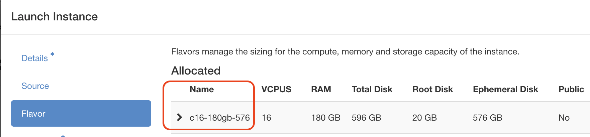
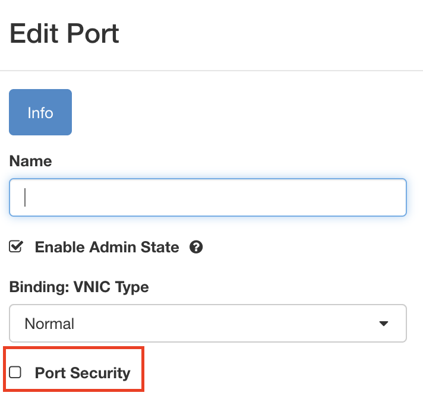

# Running Nextmini's dataplane nodes in virtualized network namespaces on a single host

This example demonstrates and tests the startup time and memory usage when spawning different numbers of nodes using the namespace feature of Nextmini.

## Running the Single Host Example

### Step 1: Run the Launcher Script

Run the launcher script to apply sysctl tuning and start a tmux session with the controller on the left and the dataplane on the right:

```bash
./examples/namespace/run.sh --n-nodes 800
```

The `--n-nodes` flag updates both the controller config and dataplane automatically.

The script raises ARP neighbor table thresholds and netlink socket buffers to avoid "Exchange full (os error 54)" errors during rapid veth creation. Pass `--sysctl-only` to apply tuning without starting tmux. The tmux session requires `tmux` to be installed on the host.

The sysctl parameters:

- `gc_thresh1`: Soft minimum — minimum ARP entries to maintain
- `gc_thresh2`: Soft maximum — triggers aggressive garbage collection
- `gc_thresh3`: Hard maximum — absolute limit on ARP entries

The script also sets `ulimit -u 20000` and `ulimit -n 200000` for large node counts.

### Step 2: Observing the results

You should see output similar to the following in the controller terminal:

```bash
controller  | 2026-01-01T00:46:19.983746Z  INFO controller::new_node: All 800 nodes are now connected. Sending node addresses, link rates and flows to all nodes.
controller  | 2026-01-01T00:46:19.983773Z  INFO controller::new_node: Skipping AddNodeAddress broadcast (no Max-mode nodes configured).
controller  | 2026-01-01T00:46:20.187730Z  INFO controller::new_node: All dataplane nodes have connected. It takes 55.40 seconds since the first node arrived.
controller  | 2026-01-01T00:46:20.187754Z  INFO controller::new_node: Dataplane node 786 reports its local topology is ready.
controller  | 2026-01-01T00:46:20.187757Z  INFO controller::new_node: All dataplane nodes have finished wiring their topologies. Broadcasting topology-ready signal.
controller  | 2026-01-01T00:46:20.187760Z  INFO controller::new_node: Broadcasting topology-ready signal to 800 dataplane nodes.
```

Note: the controller log "All ... nodes are now connected" refers to nodes connecting to the controller and completing `StartUp`. If your controller config includes a topology (e.g., `type = "ring"`), dataplane nodes will continue wiring node-to-node connections after this point. For the connection-only scaling baseline, use a controller config with no topology edges (e.g., `examples/namespace/controller-config-10k.toml`).

Monitor memory usage in a new terminal:

```bash
free -h
```

### Step 3: Cleaning up

To clean up the environment:

Press `Control + C` in both the controller and namespace terminals, and then remove the active `veth` interfaces:

```bash
./examples/namespace/cleanup.sh
```

You should see:

```bash
The virtual network environment has been successfully cleaned up. You can now run the controller containers again.
```

## Development and Testing Notes

### Launching a virtual machine

This example can be tested with the `c16-180-576` configuration in the Arbutus cloud (a part of the Digital Research Alliance of Canada). As shown in this figure, `c16-180-576` is the name of `Flavor` in the Arbutus cloud, which manage the sizes for the compute, memory and storage capacity of the instance.



For testing, you can directly launch an instance using the pre-configured snapshot `ns-test-2510`, which includes all necessary dependencies and configurations.

### Testing the startup time and memory consumption

To test the total amount of time for starting up all the nodes and the memory consumption afterwards:

- Configure the desired `n_nodes` value with ring preset topology

- Remove the `[routing]` section from configuration files (no persistent TCP connections and no routes needed)

The following lines could be used in `examples/namespace/controller-config.toml` for testing purposes:

```toml
protocol = "tcp"

[topology]
type = "ring"
ring_config = { n_nodes = 600 }

[db]
user = "pgusr"
password = "pgpwrd"
host = "170.16.8.2"
database = "nextmini"
port = "5432"
```

### Benchmark Results

The following benchmarks were recorded:

| Topology | Nodes | Wiring Time | Memory Before | Memory After | Per Node | Notes |
|----------|-------|-------------|---------------|--------------|----------|-------|
| Ring | 100 | 5.87s | 1.5GB | 1.8GB | ~3MB | |
| Ring | 200 | 11.20s | 1.5GB | 2.0GB | ~2.5MB | |
| Ring | 300 | 47.22s | 1.5GB | 2.2GB | ~2.3MB | |
| Ring | 400 | 77.63s | 1.5GB | 2.5GB | ~2.5MB | |
| Ring | 500 | 165.30s | 1.6GB | 2.7GB | ~2.2MB | Before ARP fix |
| Ring | 500 | 32.64s | 1.5GB | 2.8GB | ~2.6MB | After ARP fix |
| Ring | 600 | 42.52s | 1.5GB | 2.9GB | ~2.3MB | After ARP fix |
| Ring | 700 | 48.85s | 1.5GB | 3.1GB | ~2.3MB | After ARP fix |
| Ring | 800 | 55.40s | 1.6GB | 3.3GB | ~2.1MB | After ARP fix |

Example controller log output:

```
controller  | 2026-01-01T00:46:20.187730Z  INFO controller::new_node: All dataplane nodes have connected. It takes 55.40 seconds since the first node arrived.
```

First check the initial memory consumption:

```bash
free -h
```

Example output:
```text
               total        used        free      shared  buff/cache   available
Mem:           176Gi       3.3Gi       162Gi       1.2Mi        12Gi       173Gi
Swap:             0B          0B          0B
```

After starting the controller and the database (see Step 3), check the memory consumption again:

```text
               total        used        free      shared  buff/cache   available
Mem:           176Gi       4.1Gi       161Gi        15Mi        12Gi       172Gi
Swap:             0B          0B          0B
```

It can be seen that approximately 0.8 GB (4.1 - 3.3) is used by the controller and PostgreSQL services.

### Monitoring the database
### The logic of assigning IP addresses

With `bridge_ip = 172.16.8.1`, IP addresses are assigned as:

- `idx = 0 → offset = 3 → IP = 172.16.8.4`

- Node ID calculation: `node_id = (ip - base) = ((k + 4) - 3) = k + 1`

- Therefore: `veth0a → node_id 1`

!!! warning

    The following instructions have not been verified to work correctly.


# Running Nextmini's dataplane nodes in virtualized network namespaces on multiple hosts

## Run Multiple Hosts Example on Arbutus

Before running any commands, the port security on each instance should be disabled to allow traffic between instances.

Choose `Edit port security group` and click `Edit Port` button.
Then the following window will pop up, uncheck `Port Security` and click `Update` button.



These steps are required to be done on all instances before running the example.

## Running the Example

There is an instruction for running multi-host example in `examples/ns-public`.

### Step 1: Increasing the ARP Table Limits

Run the sysctl tuning script on each VM:

```bash
./examples/namespace/run.sh --sysctl-only
```

### Step 2: Configuring the number of nodes in the controller

To change the number of nodes, you need to update the `n_nodes` field in the controller's configuration file, `controller-config.toml`, or specify the network topology to make sure that the number of nodes coincides with the configuration in the data plane.

In this ns-public example, we use 10 nodes for quick test. Each VM instance runs 5 nodes.

### Step 3: Starting the controller and database engine

Start the controller and database engine using the compose file in `examples/ns-public` on the controller VM.

### Step 4: Running the project

On the first VM, run the dataplane using `examples/ns-public/VM1-config.toml`.

Then the logs on Controller terminal would be observed.

Then on another VM, repeat **step 4** with `examples/ns-public/VM2-config.toml`.

Note that `node_id_offset = 5` is set in `VM2-config.toml` to make sure that the node IDs do not overlap with those in the first VM.

### Step 5: Cleaning up

To clean up the environment on all dataplane VM instances:

1. Press `Control+C` in both the controller and namespace terminals
2. Remove created veth interfaces:

```bash
./examples/ns-public/cleanup.sh
```
