# Strato Arbutus Setup Guide
This is a guide for setting up a large scale Strato network on the Compute Canada Arbutus Cloud.

## Overview
Setting up Strato over the Arbutus Cloud can be generally divided into setting up the controller and the data plane. The core strategy is to first set up the controller, then set up *one* data plane node on a single VM. Afterwards, clone image of the VM to get more nodes.

## Step 1: Launching a new instance
We first need to launch a new VM instance on Arbutus Cloud. We first log in to the weesb consoles at https://arbutus.cloud.computecanada.ca/, then from the navigation panel on the left, navigate to Project -> Compute -> Instances page.

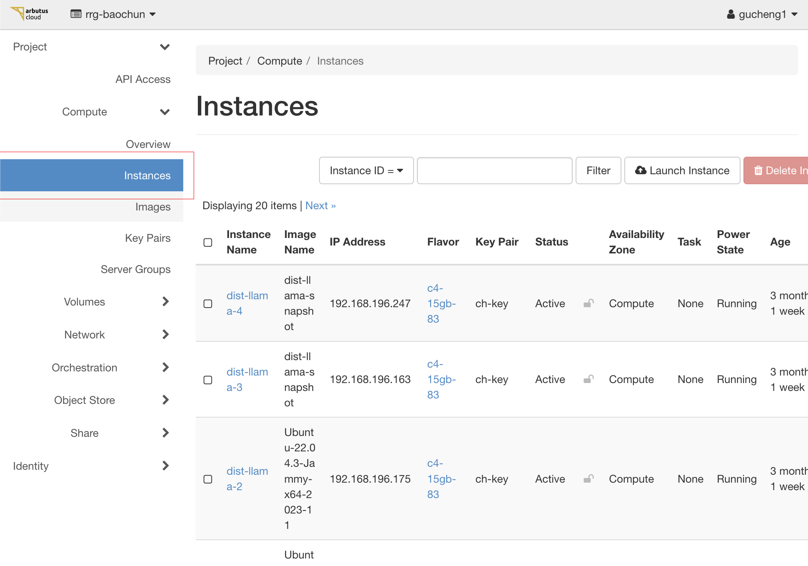

Next, from the top right, click `Launch Instance`.

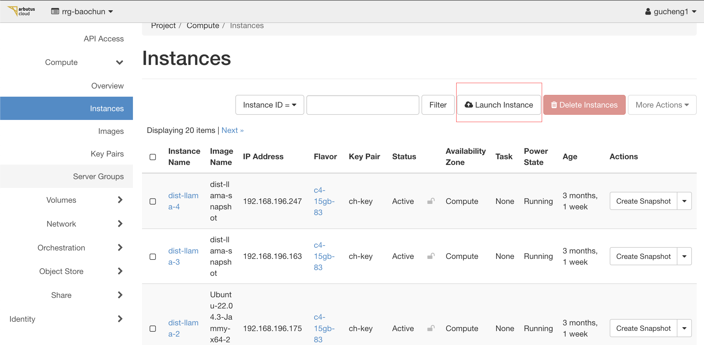

In the pop-up menu, enter an appropriate name for your instance.

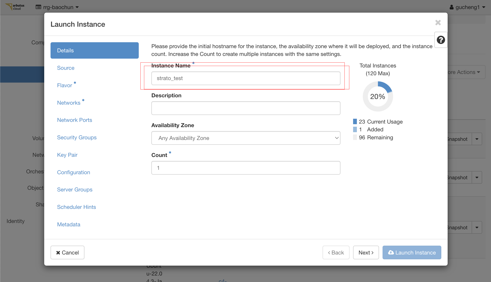

Next, navigate to the `Source` tab on the right. In the `Select Boot Source` drop-down menu, choose `image`. Then, in the search-bar under `Available`, search for `ubuntu`. There should be several versions of Ubuntu to choose from in the bottom. At the time of writing, Strato works with Ubuntu 20.04, but should also be compatible with later versions. To select an Ubuntu version, click the up-arrow button on the right of the corresponding version.

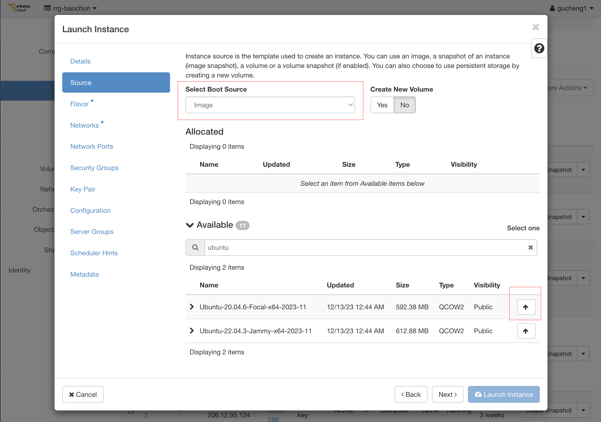

We now need to choose an instance flavor. Navigate to the `Flavor` tab on the right, and there should be a list of flavors to choose from. Strato is design to be able to leverage up to three cores to improve single-stream performance. Hence, **we recommended selecting a flavor with at least 4 cores.** Once a flavor is determined, click the up-arrow to select it.

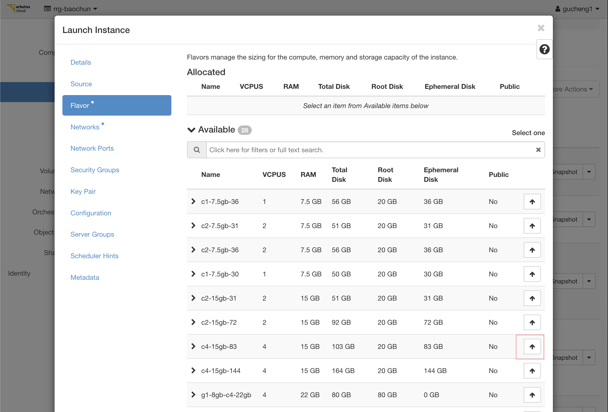

Next, navigate to the `Networks` tab and select `rrg-baochun-network` by clicking on the up-arrow associated with it.

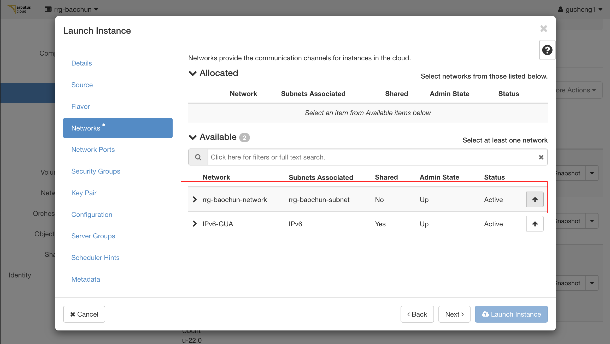

We also need to configure a firewall. To do so, navigate to the `Security Group` tab. Since this guide is intended for setting up an Arbutus-exclusive Strato network, we only need to allow ssh connection to our instance. Select `Gateway` from the list of options by clicking on the associated up-arrow. *Bonus: if needing to connect to external networks, it is recommended to create a custom security group that allows egress traffic on selected port ranges and select the security group in this step.*

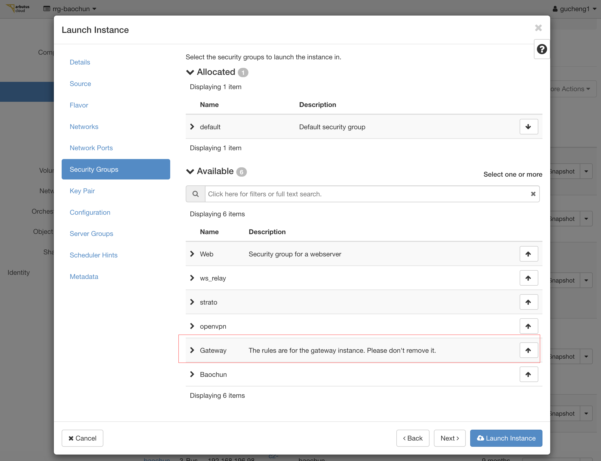

Finally, we add an ssh key pair to the instance, so we can connect to it. Once it is done we can click the `Launch Instance` button on the bottom-right corner to launch the instance.

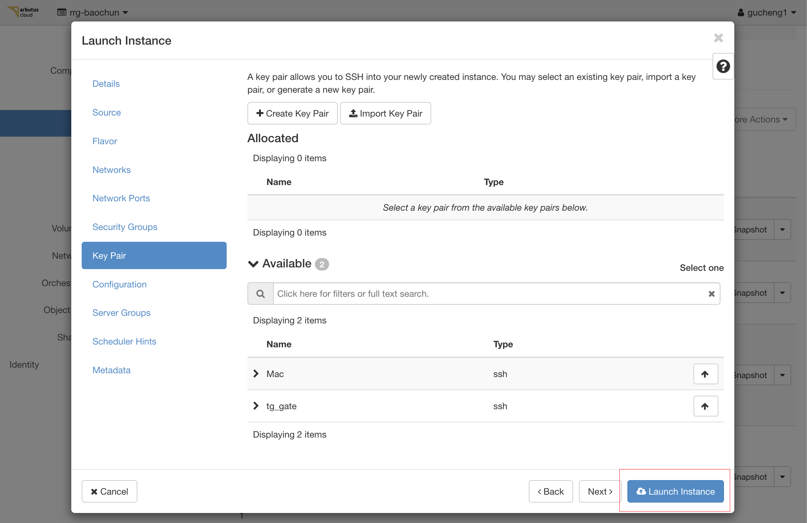

The instance can take several minutes to be up. Once it is up, we need to associate it with a floating IP address before we can connect to it. To do so, select the drop-down menu associated with the instance, and choose `Associate Floating IP`

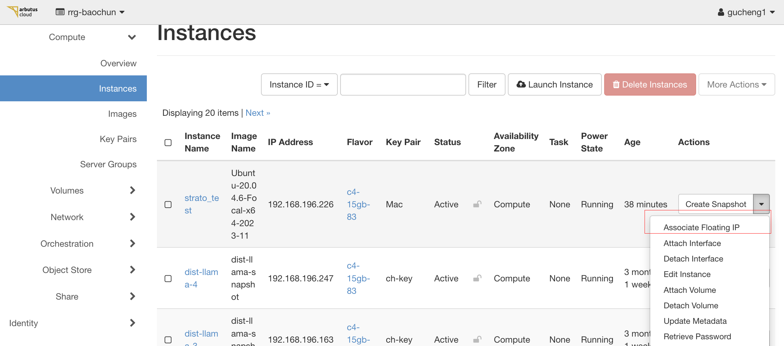

In the pop-up menu, select a floating IP from the drop-down menu, then click `Associate` on the bottom-right.

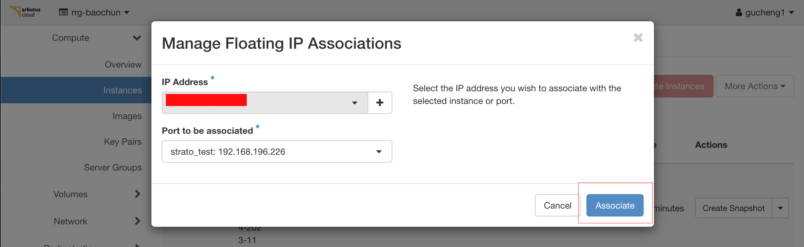

All done! Note, if no more floating-address is available, another option is to connect to the instance from another gateway instance. Make sure to select the appropriate ssh key so the gateway instance can connect to the new instance.

## Step 2: Basic VM configurations

Once the instance is up, open a local terminal and connect to it via
```bash
ssh ubuntu@<floating-ip>
```
 Replace `<floating-ip>` with the floating IP address of the instance.


Once connected, we may need to configure ssh-key to clone Strato from Github. Once this is done, clone Strato from Github by running
```bash
git clone git@github.com:iQua/strato.git
```
 (Note the location of the repository can be changed by modifying the URL).

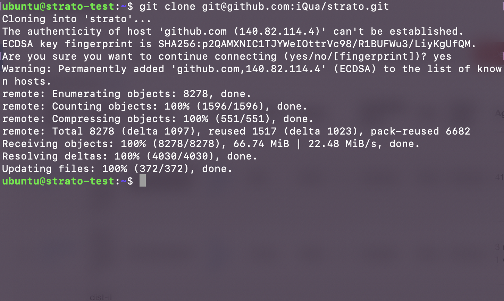

Next, we want to install Docker via the follwoing command:

```bash
sudo apt update && sudo apt install docker.io -y && sudo apt install docker-compose -y
```
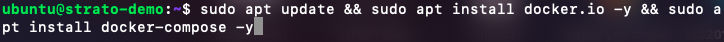

Arbutus instances typically have really small disk space on the root partition. To avoid running out of disk space, we can move the docker root directory to `/mnt`. We need to first stop the docker service with the following:

```bash
sudo systemctl stop docker
```

Then, we need to create a new folder for the docker root directory under.

```bash
sudo mkdir -p /mnt/docker
```

We can now edit the docker service file the change the docker root directory. To do so, open the docker daemon file with a text editor such as vi or nano,

```bash
sudo vi /etc/docker/daemon.json
```

Then edit the file to look like the following:

```bash
{
    "data-root": "/mnt/docker"
}
```

Finally, we can start the docker service again with the following command:

```bash
sudo systemctl start docker
```

We can test the root directory has been changed by running `docker info` and checking the `Docker Root Dir` field.

```bash
sudo docker info -f '{{.DockerRootDir}}'
```
It should show something like `/mnt/docker`.

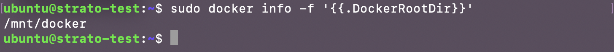

Having to type `sudo` every time we run a docker command can be annoying. To avoid this, we can add the current user to the docker group with the following command:

```bash
sudo usermod -aG docker $USER
```

Log out and log back in to apply the changes.

## Step 3: Compiling Strato's Docker images

We can now compile Strato's Docker images. To do so, navigate to the Arbutus example in Strato's directory with

```bash
cd ~/strato/examples/arbutus
```

Then, run the following command to compile Strato's Docker images:

```bash
docker-compose build
```

Building the images can take a while, but the final result should look like the following:

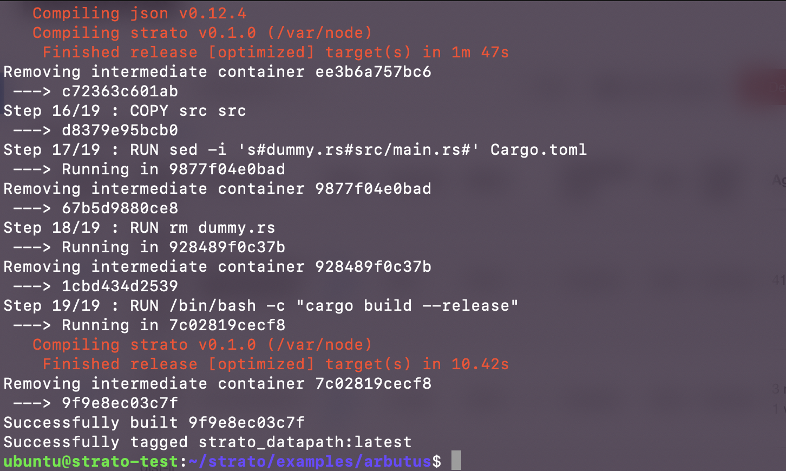

## Step 4: Running the controller

Strato's comes with some default configurations for the controller in the `config.json` file. Let's go over them first.

```json
{
    "routes_preset": {
        "type": "full_mesh",
        "n_nodes": 32
    }
}
```

- `routes_preset`: This field is used to set up the initial routes in the network. The `type` field can be set to `full_mesh` or `ring`. If set to `full_mesh`, the controller will set up routes between all nodes in the network. The `n_nodes` field is used to set the number of the nodes to set up routes for. It is fine as long as it is larger than the numbers of nodes in the network, but it is recommended to set it to the actual number of nodes in the network.

We can start the controller with the following command:

```bash
docker-compose up controller
```

The controller takes a few seconds to start. Once it is up, it should look like the following:

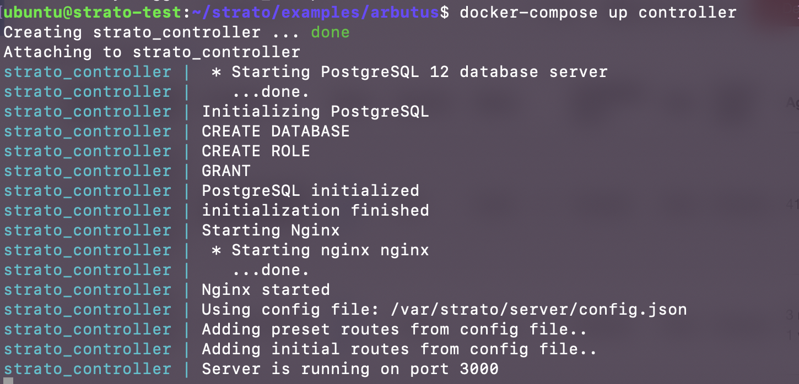

Note that at the bottom, the controller says that it is running on port 3000. **We can ignore this for now, since the controller docker image comes with a built-in nginx server that listens on port 80.**

Once we verified that the controller is running, we can stop it with `Ctrl+C`.

## Step 5: Running the data plane
The data plane also comes with some default configurations in the `config.toml` file. Let's go over them as well.

```yml
public_network_port: 10001
public_network_interface: ens3
restart_on_disconnect: true
```

- `public_network_port`: This field is used to set the port that the data plane listens on for incoming connections. Any port would work.
- `public_network_interface`: This field is used to set the network interface that the data plane listens on for incoming connections. The default value is `ens3`, which is the default network interface on Arbutus instances. It is recommended to keep this value as is.
- `restart_on_disconnect`: If set to `true`, the data plane will restart itself if it loses connection to the controller. This is useful for maintaining the network's connectivity.

Aside from these configurations, one additional configuration is required for the data plane to connect to the controller. This is the controller's IP address, which is directly configured in the `docker-compose.yml` file. It should be on the very last line of the file, and should look like the following:

```yml
    command: /bin/bash -c "./target/release/strato ws://127.0.0.1:80"
```

As we can see, it is currently configured to use localhost at `127.0.0.1`. We need to change this to the controller's IP address. If we plan on using this VM to host the controller, we can find out the IP address with the following command using the `ifconfig` command.

```bash
sudo apt install net-tools -y && ifconfig
```

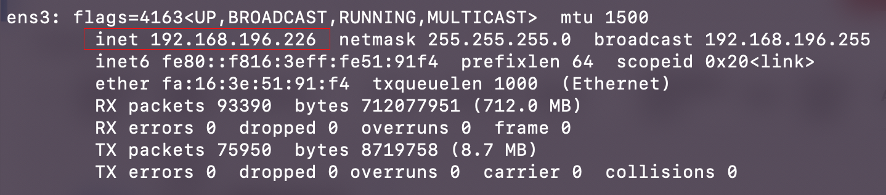

The IP address should be under the `ens3` interface. We can now edit last line of the `docker-compose.yml` file to look like the following

```bash
command: /bin/bash -c "./target/release/strato ws://<controler-ip>:80"
```

Replace `<controller-ip>` with the controller's IP address.

We can now start the data plane with the following command:

```bash
docker-compose up node
```

The following should be displayed:

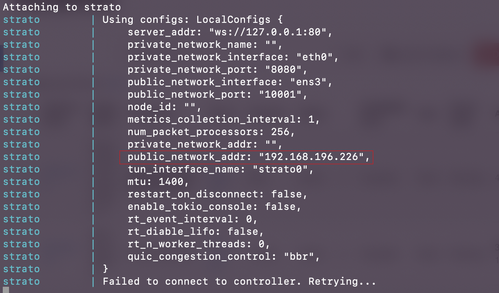

The output displays a list of the node's config parameters. The node automatically detects the local IP address from `ens3` interface. We can verify the `public_network_addr` is indeed the IP address of the instance.

Note that at the bottom, the node says that it `Failed to connect to controller. Retrying...`. This is because the controller is not running. We can ignore this for now.

Once we verified that the node is running, we can stop it with `Ctrl+C`.

We can not test the node withe controller running. We can simply run

```bash
docker-compose up
```

The node is successfully connected to the controller if the output displays the following:


Once we verified that the node is running, we can stop it with `Ctrl+C`.

## Step 6: Running data plane node on start-up

We can configure the data plane node to start up automatically when the instance is started. To do so, we need to move the systemd service file for the data plane node from the arbutus example folder to the systemd diretory. We can do so with the following command:

```bash
sudo cp ~/strato/examples/arbutus/strato-node.service /etc/systemd/system/
```

The content of the systemd file should look like the following:

```bash
[Unit]
Description=Strato Node
After=docker.service
Requires=docker.service

[Service]
Restart=always
ExecStart=/usr/bin/docker-compose -f /home/ubuntu/strato/examples/arbutus/docker-compose.yml up node
ExecStop=/usr/bin/docker-compose -f /home/ubuntu/strato/examples/arbutus/docker-compose.yml down

[Install]
WantedBy=multi-user.target
```

We can now enable the service with the following command:

```bash
sudo systemctl enable strato-node
```

To verify that the service is enabled, we can restart the instance. Once the instance is up, we can check the status of the service with the following command:

```bash
journalctl -u strato-node.service
```
Then, jump to the end of the log with `Shift+G`. The log should display the following:

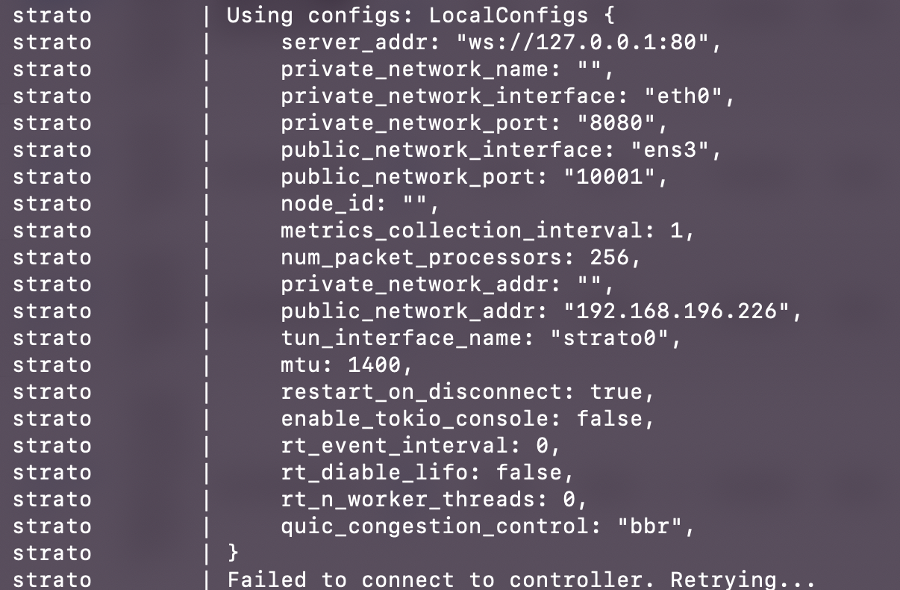

## Step 7: Cloning the VM.
The VM is now set up as a data plane node. We can now clone the VM to create more nodes. To do so, we can go back to the web console, and from the navigation panel on the left, navigate to Project -> Compute -> Instances page.

Select the instance we just set up, and from the drop-down menu, select `Create Snapshot`.

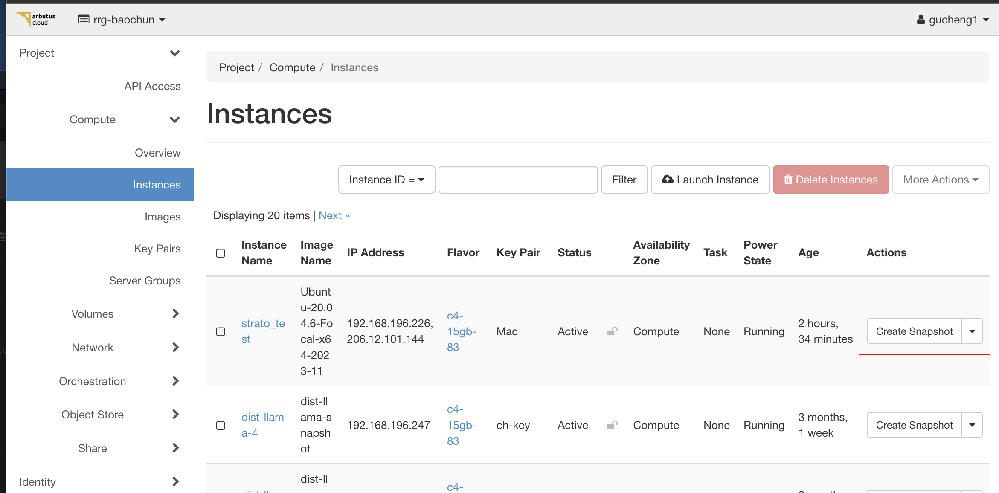

In the pop-up menu, enter an appropriate name for the snapshot, then click `Create Snapshot`.

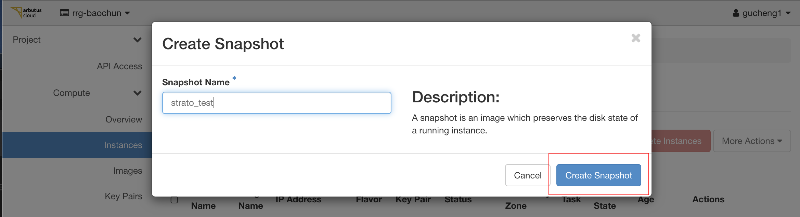

It can take a few minutes for the snapshot to be created. Once it is done, we can create a new instance from the snapshot. To do so, select the snapshot, then from the drop-down menu, select `Create Instance`.

In the pop-up menu, enter an appropriate name for the instance. Then, under `count` enter the number of instances to create. We choose 2 for this tutorial.

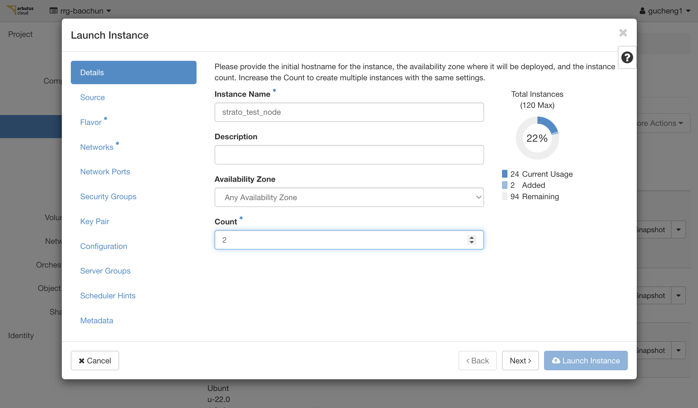

Next, navigate to the `Source` tab on the right. In the `Select Boot Source` drop-down menu, choose `Instance Snapshot`. Then, in the search-bar under `Available`, search for the snapshot we just created. Once it is found, click the up-arrow button on the right of the snapshot.

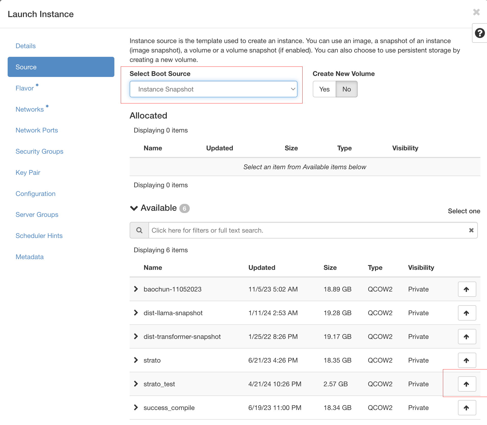

Then, in the `Flavor` tab, select the same flavor as the original instance in Step 1.


Next, navigate to the `Networks` tab and select `rrg-baochun-network` by clicking on the up-arrow associated with it.


Finally, we are ready to launch the instances. Click the `Launch Instance` button on the bottom-right corner to launch the instances.

Once the instances are up, they should automatically connect to the controller and form a network. On the original instance, we can verify that the new nodes are connected running the controller, which should display the following:


(Note, the install routes message can be potentially longer or shorter depending on the number of routes to install. The important part is that the message for two nodes are displayed).

All done! We have successfully set up a Strato network on the Arbutus Cloud.

## Step 8: Configuring the network throughput.
Strato comes with built-in network throughput regulation capability. To configure the network throughput, we can edit the `config.json` file in the controller's directory and add a `link-rates` object to the file. The object should look like the following:

```json
    "link_rates": [
        {
            "src_node_id":1,
            "dst_node_id":2,
            "bandwidth": 10000000
        },
        {
            "src_node_id":2,
            "dst_node_id":1,
            "bandwidth": 10000000
        }
    ]
```

The `src_node_id` and `dst_node_id` fields are used to specify the source and destination nodes of the link. The `bandwidth` field is used to specify the bandwidth of the link in bits per second. The example above sets the bandwidth of the link between node 1 and node 2 to 10 Mbps.

The overall modified JSON file should look like this

```json
{
    "routes_preset": {
        "type": "ring",
        "n_nodes": 32
    },
    "link_rates": [
        {
            "src_node_id":1,
            "dst_node_id":2,
            "bandwidth": 10000000
        },
        {
            "src_node_id":2,
            "dst_node_id":1,
            "bandwidth": 10000000
        }
    ]
}
```

## Step 9: Testing throughput using iperf3
We can test the throughput of the network by running iperf3 on the nodes. Strato's data plane nodes come with iperf3 installed. However, to send and receive data using iperf through the nodes, we need to know the virtual addresses assigned to the nodes on each VM.

By Default, Strato follow a very simple protocol to assign virtual addresses to the nodes, in the form of `10.0.0.x`, where x is the node ID. For example, node 1 has the virtual address of `10.0.0.1` and node 2 has the virtual address of `10.0.0.2`.

Another piece of information we need is which physical VM is node 1 and which is node 2. There are several ways to achieve this. By default, this information can be found from the console log of the controller. As shown in the screenshot below, the controller logs whenever a new node connects to it:

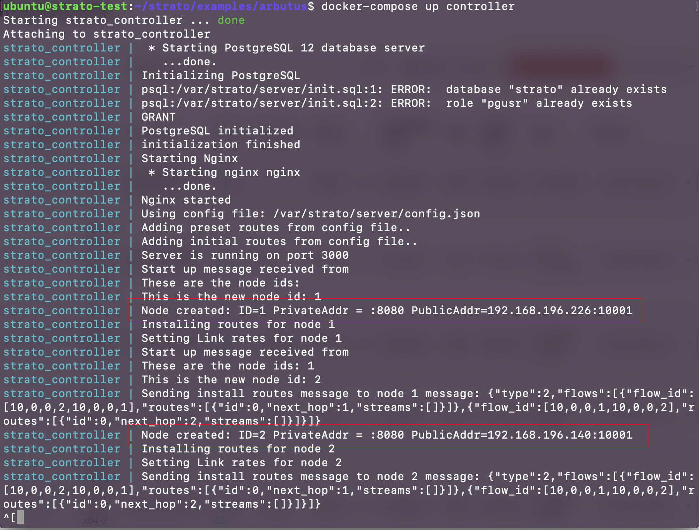

From the above, we can easily see that node 1 has the virtual address of 192.168.196.226 and node 2 has the virtual address of 192.168.196.140. You can identify the respective VMs by these addresses.

Once you have identify the VMs and their node IDs, you can choose one of them as the iperf server and one of them as the iperf client. It does not matter which one; in this example, we choose node 2 as the server and node 1 as the client.

To start the iperf server on node 2, on the VM that is node 2, run the following command:

```bash
docker exec -it strato /bin/bash -c "iperf3 -s -p 5201"
```

This starts the iperf server on port 5201.

To start the iperf client on node 1, on the VM that is node 1, run the following command:

```bash
docker exec -it strato /bin/bash -c "iperf3 -c 10.0.0.2 -cport 12345"
```

This starts the iperf client and connects it to the iperf server on port 5201. The `-cport 12345` flag is used to specify the source port of the client. This is useful if we want to assign this stream to a specific route in step 10 later.

We can see the output on node 1 as follows:

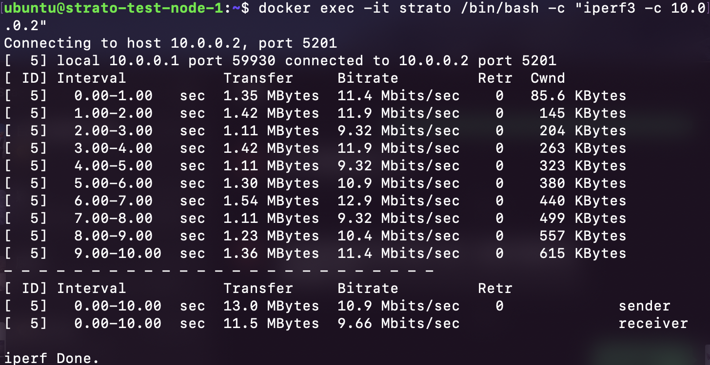

We can see that the throughput is fairly consistent at around 10 Mbps. Do not worry if it goes slightly over or under 10 Mbps; this log reflects how much data the iperf client is trying to send through the node 1, which is not necessarily the same as the actual throughput. To get a more accurate measurement, we can check the log on the server side on node 2:

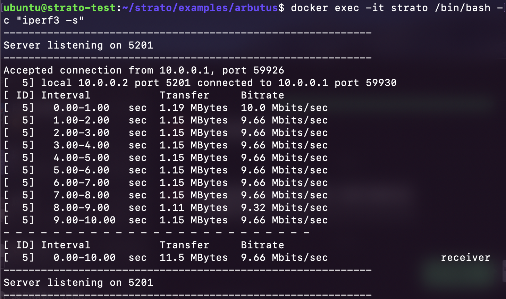

We can see that the throughput is fairly consistent at < 0.5 Mbps less than 10 Mbps. It is normal to expect the throughput to be slightly lower than the configured bandwidth due to overheads and limitation in the accuracy of Strato's rate limiting mechanism.
## Step 10: Configuring the routes.

Instead of the preset outs, Strato also allows configuring custom routes, we can edit the `config.json` file in the controller's directory and add a `routes` object to the file. The object should look like the following:
iperf3 -s -p 5201
```json
    "routes": [
        {
            "hops": [1,3,2],
            "id": 1,
            "streams": [[12345,5201]]
        },
        {
            "hops": [2,5,1],
            "id": 1,
            "streams": [[12345, 5202]]
        },
        {
            "hops": [2,6,1],
            "id": 2,
            "streams": [[5201,12345], [12345,5203]]
        }
    ]
```

The `hops` field is used to specify the hops of the route. Since Strato allows muli-path routing, the `id` field is used to distinguish between paths with the same source and destination nodes. For example, the first two routes in the example above have two different source and destination nodes, hence they can both share the same route ID of "1". However, the second and third routes have the same source and destination nodes, hence they need to have different route IDs to be distinguished. The can can be any integer between 0-255.

The `streams` field is an *optional* field used to specify the streams that are sent over the route. The streams are specified as a list of two integers, where the first integer is the source port of the stream, and the second integer is the destination port of the stream. The example above bind the streams [12345,5201] to first route, [12345,5202] to the second route, and both [5201,12345] and [12345,5203] to the third route.

If the `stream` field is omitted, Strato will assign all streams between parallel paths using round-robin. The same applies for unspecified streams in the field, which will also be assigned using round-robin.
