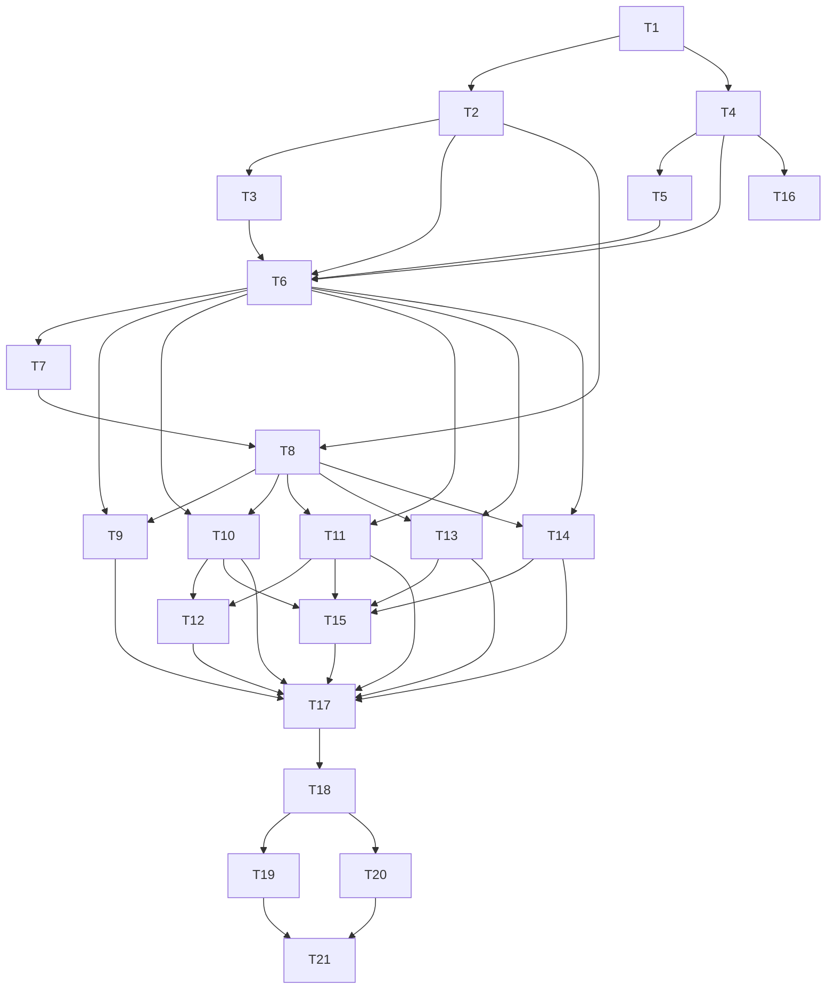

# Controller Multi-Pane TUI Redesign Plan (Ratatui)

Date: 2026-02-16  
Owner: Controller team  
Status: Revised draft (post review)

## 1. Goal

Replace the current Python monitor (`tools/monitor/dashboard.py`) with a Rust TUI built on [`ratatui`], while preserving monitor parity first and then expanding to richer topology/multicast/event observability. The default design separates OLTP writes from observability reads: controller writes stay on primary Postgres, while monitor analytics run on a replica-backed read model.

## Ratatui references for implementation

- Backend + terminal lifecycle: <https://ratatui.rs/concepts/backends/> and <https://ratatui.rs/concepts/backends/alternate-screen/>
- Setup helpers (`ratatui::init` / `restore`) and convenience patterns: <https://docs.rs/ratatui/latest/ratatui/fn.init.html>, <https://docs.rs/ratatui/latest/ratatui/struct.Terminal.html>
- Layout system (`Constraint`, `Layout`, `split`) for multi-pane responsive UIs: <https://ratatui.rs/concepts/layout/> and <https://ratatui.rs/concepts/layout/#layout>
- Event handling model with crossterm (`event::poll`, `event::read`, `KeyEventKind::Press`) and key dispatch patterns: <https://ratatui.rs/concepts/event-handling/> and <https://ratatui.rs/tutorials/counter-app/basic-app/>
- Frame + widget rendering (`Frame`, `render_widget`, table/list/chart widgets): <https://ratatui.rs/> examples at <https://ratatui.rs/examples/>

## 2. Code-grounded constraints and assumptions

The implementation plan is explicitly aligned to current code behavior:

1. Postgres notifications are partial today:
   - Routes: `auto_sync_routes` and `sync_routes`
   - Flow inserts only: `auto_sync_flows`
   - Group membership changes: `sync_group_routes`
   - No notifications for high-frequency `metrics` and most `flows`/`app_flows` updates.
2. `LosslessStats` is log-only currently; it is not persisted in DB.
3. `metrics` rolling-window queries are core to monitor UX; MVP must achieve target latency with query shaping first and no required schema changes.
4. LISTEN/NOTIFY is ephemeral; it is not an audit trail.
5. Controller resets DB by default unless `CONTROLLER_RESET_DB` disables reset.

## 2.1 Premortem (6-month failure analysis)

Most likely failure modes and prevention actions:

1. UI stalls or corrupts terminal in production.
   - Risk: backend assumptions break on older tmux/SSH/Windows hosts.
   - Plan fix: first-class fallback path to non-alternate-screen, explicit raw-mode toggling, and startup capability probe before entering full-screen mode.
2. Stale or misleading data under load.
   - Risk: LISTEN misses events, polling jitter drift, and slow queries produce apparent regressions.
   - Plan fix: per-domain freshness timestamps, staleness indicators, hard DB query timeouts, and LISTEN-disconnect promotion to polling-only mode with warning state.
3. Query cost collapse after real traffic growth.
   - Risk: index plans drift and windows scans regress.
   - Plan fix: baseline/CI query budgets, partitioned query timeouts, in-memory top-N cache for top flows, capped historical rows in every state buffer, and gated additive indexes only when benchmarks prove necessity.
4. Merge conflicts in UI state when async updates arrive out of order.
   - Risk: flickering tables, duplicate rows, inconsistent sort order.
   - Plan fix: versioned reducer events, deterministic merge ordering, and reducer fuzz tests for reorder/retry sequences.
5. Operators cannot recover when failures occur.
   - Risk: no quick fallback to Python monitor or clear error state.
   - Plan fix: launch gate requires rollback docs, hotkey for fallback mode, and visible degraded-mode banners (mode, source of truth, staleness).
6. Upgrade and rollout surprises.
   - Risk: migration assumptions break in mixed-version deployments.
   - Plan fix: additive-only bootstrap only for TUI needs, schema gates, and smoke run against reset-on/off modes.

## 2.2 OLTP/analytics separation architecture (default)

Target runtime architecture:

```text
Controller writes -> Postgres primary -> read replica -> obs-indexer (read model) -> TUI / --json / AI agents
```

Design rules:

1. Primary DB is the write authority and should not be the default target for heavy monitor analytics.
2. Monitor read path preference order:
   - `obs-indexer` endpoint (default in production)
   - direct read replica queries (fallback)
   - direct primary queries (dev/emergency fallback only, with warning banner).
3. `obs-indexer` uses hybrid ingestion:
   - LISTEN invalidation where available
   - watermark polling for guaranteed catch-up.
4. Every read-model response includes:
   - `freshness_age`
   - `source_mode` (`listen+poll`, `poll-only`, `replica-direct`, `primary-fallback`)
   - `confidence`.
5. Schema-minimal policy remains in force for MVP; this architecture must work without required DB schema changes.

## 3. MVP and staged scope

## 3.1 MVP (must ship first, parity with Python monitor)

1. App flows table (`app_flows`)
2. User flows table (`flows`)
3. Per-node send/recv rates (rolling 5s from `metrics`)
4. Per-link rate table (rolling 5s from `metrics`)
5. Top-N flows by rate (rolling 5s from `metrics`)
6. Zero required schema changes (no new tables/columns/triggers/indexes) for MVP.
7. Default production read path does not run heavy analytics on primary DB.

## 3.2 Stretch scope (after MVP parity is stable)

1. Topology/routes drilldown panes
2. Multicast panes
3. Event pane beyond live stream semantics
4. Command palette and advanced navigation
5. Persisted telemetry (`LosslessStats`) and persisted controller event audit log

## 3.3 Core workflows (UI design center)

### W1. Find top offender flow in under 30 seconds
- Operator question: "Which flow is currently consuming/causing the most pain?"
- Happy-path interaction:
  - Launch into Top Flows-focused default view.
  - Keep sort default on highest current rate and show flow identity columns without extra drilldown.
  - One-key jump to flow details (app flow row, user flow row, tuple decode, recent rate trend).
- UX budget:
  - <= 30s to identify a specific offender flow from app launch.
  - <= 3 interactions from default landing state.

### W2. Confirm or reject route flap in under 45 seconds
- Operator question: "Did a route change/flap explain the observed rate/health change?"
- Happy-path interaction:
  - Show recent route-change signal and timestamp in always-visible status/header.
  - One-key jump from route-change/event indicator to route drilldown and impacted links.
  - Correlate with recent link-rate movement in same workflow without full context switch.
- UX budget:
  - <= 45s to confirm or reject route flap as proximate cause.
  - <= 4 interactions from default landing state.

### W3. Verify multicast membership drift in under 60 seconds
- Operator question: "Did group membership diverge from expectation, and where?"
- Happy-path interaction:
  - Group table defaults to "recently changed" / "drift-first" sorting.
  - Highlight missing/extra members and stale group-route updates inline.
  - One-key drilldown from group row to member + route tree detail.
- UX budget:
  - <= 60s to identify drifted groups and affected nodes.
  - <= 5 interactions from default landing state.

Workflow design constraints for all panes:
- Every workflow must have visible keyboard hints and a direct jump path from global status bar.
- Every "anomaly" row should support immediate investigate action (no multi-step menu traversal).
- Every pane must show freshness timestamp and data source mode (`listen+poll` or `poll-only`).

## 4. Revised dependency graph



## 5. Task plan

### T1. Requirements lock and MVP parity contract
- depends_on: []
- Deliverables:
  - Explicit MVP parity checklist against `tools/monitor/dashboard.py` queries/formatting.
  - Non-goals for MVP to prevent scope creep.
  - Refresh budget and supported terminal sizes for MVP.
  - Workflow contracts for `W1`, `W2`, `W3` with interaction-count and time budgets.
- Acceptance:
  - MVP checklist is approved and traceable to Python monitor behavior.
  - Workflow contracts are testable and approved as primary UX acceptance criteria.

### T2. Crate bootstrap and runtime foundation
- depends_on: [T1]
- Deliverables:
  - New workspace crate (recommended `controller-tui`).
  - `ratatui` integration and app startup path using `ratatui::init()`/`restore()` and explicit teardown fallback paths.
  - backend choice and rationale (default to crossterm unless terminal constraints force alternate backend), with raw mode + alternate screen handling.
  - Clean teardown in inline and alt-screen mode.
- Acceptance:
  - `cargo check -p controller-tui` passes.
  - TUI starts and exits without terminal corruption.

### T3. Connection/config UX policy
- depends_on: [T2]
- Deliverables:
  - CLI flags for DB config and optional full URL.
  - `NEXTMINI_DB_*` env compatibility (parity with current monitor tooling).
  - Optional `config.toml` compatibility path for DB config.
  - Read-path configuration:
    - primary URL (write-authority fallback only)
    - replica URL (default direct-query fallback)
    - optional `obs-indexer` endpoint (preferred source).
  - Pool sizing defaults with dedicated listener connection for direct-query mode.
- Acceptance:
  - Local/dev/docker usage works without code edits.
  - Source selection is explicit and visible in UI status.

### T4. Data contract and query inventory
- depends_on: [T1]
- Deliverables:
  - Query map for all panes and domains.
  - Explicit choice for flow tuple decoding (decode `BYTEA` in Rust).
  - DTO design including `group_members.joined_at` and `group_routes.updated_at`.
  - Topology source strategy:
    - route inspection only for MVP
    - inferred adjacency as stretch
    - optional persisted topology table as future enhancement.
- Acceptance:
  - All UI fields map to concrete tables/columns.

### T5. Query performance prerequisites (schema-minimal MVP)
- depends_on: [T4]
- Deliverables:
  - Query-shaping-first performance profile:
    - strict bounded time windows and explicit `LIMIT` on heavy panes
    - top-N-first query paths for ranking panes
    - adaptive polling backoff when query latency exceeds budget.
  - Schema-change gate document:
    - Stage 0 (default): no schema changes
    - Stage 1 (exception): additive `CREATE INDEX CONCURRENTLY` only with benchmark evidence
    - Stage 2 (post-MVP only): any new DB objects require explicit approval and rollback path.
  - Query latency budgets per pane query (p50/p95 targets).
  - Evidence template for any requested DB exception (before/after timings, dataset shape, operational risk).
- Acceptance:
  - Seeded dataset query timings meet baseline targets with Stage 0 (no schema changes).
  - Any schema exception includes benchmark evidence and rollback notes.

### T6. Observability read model and data access layer
- depends_on: [T2, T3, T4, T5]
- Deliverables:
  - `obs-indexer` service contract (or module boundary) for snapshot queries and event stream reads.
  - Ingestion model for `obs-indexer`:
    - LISTEN invalidation
    - watermark polling catch-up
    - bounded in-memory aggregates/ring buffers for top-N and rate panes.
  - TUI data-source abstraction:
    - indexer client (preferred)
    - replica direct-query adapter (fallback)
    - primary fallback adapter (dev/emergency only with explicit warning).
  - Typed DTOs with paging/filter/sort and parameterized windows (`end_time`, `window_secs`).
  - Robust error handling and retry categories across data sources.
- Acceptance:
  - Deterministic fixture tests pass for indexer and direct-query adapters.
  - Production-default mode keeps heavy monitor analytics off primary DB.

### T7. UI state store and reducers
- depends_on: [T6]
- Deliverables:
  - Normalized state + ring buffers for time-series.
  - Reducers for selection, filters, pane focus, and merge updates.
- Acceptance:
  - Reducer tests are deterministic and cover conflict/merge paths.

### T8. Ratatui shell and responsive pane skeleton
- depends_on: [T2, T7]
- Deliverables:
  - App shell with header/footer/status.
  - Responsive large/medium/small layout scaffolding using `ratatui::layout::{Layout, Constraint, Direction}` and adaptive splits for 80x24 / 120x40 / 200x50.
  - Default landing state optimized for `W1` with explicit jump hints for `W2` and `W3`.
- Acceptance:
  - Layout renders correctly across 80x24, 120x40, 200x50.
  - Workflow shortcuts are visible without opening help overlays.

### T9. MVP parity panes implementation
- depends_on: [T6, T8]
- Deliverables:
  - App flows and user flows panes with parity fields.
  - Node/link/top-flow metrics panes with rolling-window parity.
  - Formatting parity for durations/status/rates.
  - `W1` optimization:
    - top-flow pane is first-class and default-sorted by current rate
    - one-key drilldown to correlated app/user flow details.
- Acceptance:
  - Output matches Python monitor baseline on seeded datasets.
  - `W1` budget is achievable in scripted PTY workflow tests.

### T10. Live updates phase A: ingestion invalidation
- depends_on: [T6, T8]
- Deliverables:
  - LISTEN integration for `auto_sync_routes`, `sync_routes`, `auto_sync_flows`, `sync_group_routes` in the `obs-indexer` pipeline.
  - Dirty-domain invalidation and targeted recompute logic in read model.
  - Backstop behavior for LISTEN loss: automatic reconnect with bounded retry, then degrade to polling-only mode with explicit status surfaced to TUI.
- Acceptance:
  - Supported notification-driven domains update without full reload.
  - No crash when LISTEN drops; recovery mode is visible in UI status.

### T11. Live updates phase B: polling cadence engine (read-model first)
- depends_on: [T6, T8]
- Deliverables:
  - `obs-indexer` poll loops for:
    - `metrics` (0.5-1.0s)
    - `flows` and `app_flows` lifecycle fields (1-2s)
    - low-frequency fallback polls for structural domains.
  - Direct-query fallback poll loops in TUI for replica mode only.
  - Backpressure and jitter controls.
  - Query timeout/error-classification policy, per-task cancellation, and in-memory result cap for time-series ring buffers.
- Acceptance:
  - UI freshness targets met without excessive DB load.
  - Replica/indexer modes satisfy freshness budgets without sustained primary-query dependence.
  - Polling recovers from transient DB errors without user-facing crash.

### T12. Event pane (live stream semantics)
- depends_on: [T10, T11]
- Deliverables:
  - Live event stream pane showing notifications/events since TUI start from read-model stream.
  - Explicit UX text clarifying non-persisted semantics.
- Acceptance:
  - Operators can correlate live notifications with table changes in-session.

### T13. Topology/routes stretch pane
- depends_on: [T6, T8]
- Deliverables:
  - Route-centric topology inspection.
  - Optional inferred adjacency view with cache and performance guardrails.
  - `W2` optimization: route-change spotlight and direct drilldown to impacted route/link details.
- Acceptance:
  - Route drilldown remains fast and understandable.
  - `W2` budget is achievable in scripted PTY workflow tests.

### T14. Multicast stretch pane
- depends_on: [T6, T8]
- Deliverables:
  - Group directory, members, route trees, weights, timestamps.
  - `W3` optimization: drift-first sorting and inline missing/extra member indicators.
- Acceptance:
  - Multicast state is inspectable without controller log scraping.
  - `W3` budget is achievable in scripted PTY workflow tests.

### T15. Interaction model and command palette
- depends_on: [T10, T11, T13, T14]
- Deliverables:
  - Keyboard-first navigation, focus model, help overlay.
  - Command palette for pane switching and common filters.
  - Workflow-first shortcuts:
    - jump-to-top-offenders (`W1`)
    - jump-to-route-changes (`W2`)
    - jump-to-multicast-drift (`W3`)
  - Esc/Ctrl+C policy aligned with Ratatui/crossterm event handling recommendations (`event::poll` + `event::read`, `KeyEventKind::Press` filtering) and explicit keymap tests.
  - Acceptance:
  - Full workflow is keyboard operable.
  - Core workflow paths are discoverable without memorizing full keymap.

### T16. Optional persistence track: telemetry + audit
- depends_on: [T4]
- Deliverables:
  - Explicitly post-MVP only and disabled by default.
  - Persist `LosslessStats` in DB.
  - Optional persisted `controller_events` audit stream if true audit trail is required.
  - Additive schema changes only; retention policy included.
- Acceptance:
  - New telemetry/event rows are queryable and bounded by retention policy.
  - Core monitor remains fully functional when T16 is not enabled.

### T17. Performance phase 2 and retention hardening
- depends_on: [T9, T10, T11, T12, T13, T14, T15]
- Deliverables:
  - Query/profile tuning based on real workloads.
  - Retention and cleanup policies for high-volume telemetry tables.
  - Render/update budget enforcement.
  - Read-model service SLOs:
    - snapshot latency budget
    - event-stream lag budget
    - bounded memory footprint for aggregates.
  - Query fallback safeguards: when budgets are exceeded, degrade to reduced pane refresh without dropping interactivity.
- Acceptance:
  - Stable UX under target load and refresh rates.
  - Primary DB is not the sustained source for heavy monitor analytics in production mode.
  - Explicit "degraded mode" path prevents full lockup under pressure.

### T18. Test matrix and parity suite
- depends_on: [T17]
- Deliverables:
  - Deterministic fixture strategy with seeded timestamps.
  - Parity assertions vs Python monitor aggregate outputs.
  - Split test layers:
    - reducer/state unit tests
    - snapshot render tests
    - PTY smoke tests (inline + alt-screen teardown and key paths).
  - Workflow scenario tests:
    - `W1` top offender identification path
    - `W2` flap confirmation path
    - `W3` multicast drift verification path.
  - Failure-mode tests:
    - LISTEN disconnect/reconnect
    - DB restart and transient query timeouts
    - terminal with low width/height and non-alt-screen fallback
    - high-cardinality flow bursts.
- Acceptance:
  - CI passes across required matrix and parity checks.
  - No terminal teardown regressions for tested fallback modes.
  - Workflow timing and interaction-count budgets pass on deterministic fixtures.

### T19. Rollout and migration guardrails
- depends_on: [T20]
- Deliverables:
  - Side-by-side runbook with explicit parity checklist and tolerance thresholds.
  - `CONTROLLER_RESET_DB` behavior documentation and visible TUI warning/banner.
  - Staged default switch; Python monitor remains supported fallback until parity + load criteria pass.
  - Staged read-path rollout:
    - phase 1: replica-direct default
    - phase 2: `obs-indexer` default
    - phase 3: primary fallback restricted to dev/emergency.
  - Default rollout path requires no DB migrations.
  - Standard rollback: return to Python monitor path in one command/runbook step.
- Acceptance:
  - Controlled switchover with documented fallback.
  - Production rollout confirms analytics load isolation from primary.

### T20. Failure-injection hardening
- depends_on: [T18]
- Deliverables:
  - Scripted fault-injection runbook for:
    - LISTEN drop + reconnect churn
    - DB failover/restart simulation
    - terminal resize storms
    - high-rate event bursts.
  - Hardening fixes and follow-up tickets prioritized by operator impact.
- Acceptance:
  - Must not lose control while degraded; recovery path reproducible.
  - No unrecoverable errors in fault-injection scenarios.

### T21. Launch-ready risk gate
- depends_on: [T19, T20]
- Deliverables:
  - Final risk register: unresolved risks, accepted risks, and explicit owner.
  - Signed-off launch criteria for degraded mode, staleness budget, and rollback timing.
- Acceptance:
  - Launch blocked until all blocking risks resolved or explicitly accepted.

## 6. Explicit schema/query decisions

1. Schema evolution style:
   - MVP default is no schema changes.
   - Post-MVP changes are additive-only through existing bootstrap mechanism.
   - No destructive reset assumptions in TUI logic.
   - Architecture default separates OLTP writes (primary) from observability reads (replica/read model).
2. Windowed metrics queries:
   - Parameterized by explicit end time and window size.
   - Default 5s for parity with current monitor.
3. Flow tuple rendering:
   - Decode from `BYTEA` in Rust, not DB-side formatting SQL.
4. Event pane semantics:
   - Base implementation is live stream only.
   - Persisted audit requires T16.
5. Schema-change gate:
   - No new tables/columns/triggers/indexes for MVP by default.
   - Only additive index exceptions are allowed pre-launch, and only with benchmark proof + rollback plan.
6. Read-path policy:
   - Production default: `obs-indexer` -> replica.
   - Direct primary queries are fallback-only and must show explicit degraded/warning state.

## 7. Parallelization plan

After T8, execute in parallel where possible:
- Track A: T9 (MVP parity panes)
- Track B: T10/T11 (hybrid update engine)
- Track C: T13 (topology/routes stretch)
- Track D: T14 (multicast stretch)
- Track E: T20 (failure-injection hardening after T18 prep)

Converge on T12/T15, then T17-T21.

## 8. Success criteria (revised)

1. MVP parity with Python monitor is verified by automated parity tests.
2. Hybrid update model is explicit and stable:
   - LISTEN invalidation where available
   - polling for high-frequency/missing-notification domains.
3. Early query/index prerequisites prevent metrics pane regressions.
   - MVP target is met without required schema changes.
   - Any pre-launch index exception is justified with measured evidence.
4. Event pane semantics are accurate (live stream vs persisted audit clearly distinguished).
5. Rollout includes side-by-side validation, `CONTROLLER_RESET_DB` clarity, and maintained fallback path.
6. Workflow outcomes are measurably fast and intuitive:
   - `W1` (top offender) <= 30s and <= 3 interactions
   - `W2` (route flap confirm/reject) <= 45s and <= 4 interactions
   - `W3` (membership drift verify) <= 60s and <= 5 interactions.
7. OLTP/analytics isolation is validated:
   - production-default monitoring does not depend on sustained heavy reads against primary DB
   - source mode and freshness/confidence signals are visible in UI and machine outputs.
